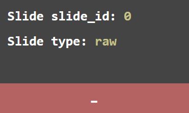
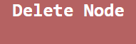
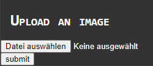

# DOCUMENTAION: NodeMagic

> This is the official documentation about the administration panel of the MagicDashboard, which controls the text and image display of the MagicMirror.

**Topics**

- [Get started](#get-started)
- [Add a node and add slides](#add-a-node-and-add-slides)
- [Edit a slide with the "Node Templating Editor"](#edit-a-slide-with-the-node-templating-editor)
- [Remove a node or a slide](#remove-a-node-or-a-slide)
- [Changing the duration of the slides](#changing-the-duration-of-the-slides)
- [Open images (Upload, View and Delete)](#open-images-upload-view-and-delete)
- [License](#license)

## Get started

> Here you can see the login data, which you need to log in at the admin panel.

### Step 1

- Open the Panel using "index.html" in your preferred browser.

### Step 2

- Log in with the following login data:
  - Server-IP: ***192.168.178.107***
  - Port: ***1337***
  - API-Key: ***ChangeMe***

---

## Add a node and add slides

- To create a node with the NodeMagic editor, click the "Add a node" button at the bottom left.

  

- After creating the node you can create different slides with the green "+" button and [then you can edit them with the "Node Templating Editor"](#edit-a-slide-with-the-node-templating-editor).

  

---

## Edit a slide with the "Node Templating Editor"

- After creating a slide, you can open it by clicking on the created slide.

  

- Then you can click on the "Open node templating editor" button to open the HTML generator for the slide.

  

- There are then different selection options, which can then be changed according to the desired operation.

  

- When you have selected and filled out the desired option, you can click on "Save" above and then confirm the generated HTML text again with "Save".

  

> In order to insert an image in the "Node Templating Editor", you have to upload an image. (For further information see [Upload an image](#upload-an-image)

---

## Remove a node or a slide

### Remove a node

- To remove a node, after you have selected the desired node, click on the "Delete Node" button, which can be seen at the top center of the page.

  

### Remove a slide

- If you want to remove a slide, press the "-" button under the desired slide.

  

---

## Changing the duration of the slides

- The editing of the duration between slides changes can be set using the text field in the upper-center area.
- There you can set in seconds how long the time between the changes is.

  

---

## Changing the rows and columns of the nodes

- To edit the rows and columns of the nodes, you can change the number to the right of the title.

  

- Note that with too many rows and columns you have to scroll. Of course this is not possible on the MagicMirror.

---

## Open images (Upload, View and Delete)

- First open our image manager by clicking the "Open images" button in the main menu.

  

### Upload an image

- To upload an image, click on the button in the top center of the image manager.

  

- After uploading the image, you can insert the image into a slide using the "Node Templating Editor". To do this, you need a headline and the file name of the image (for example: "img001.png").

***ATTENTION:*** The uploader can only process PNG and JPEG files. Other files will be uploaded, but you cannot use them.

### Delete an image

- To delete a specific image, click the "Delete image" button below the image. The image will then be deleted permanently.

  

---

## License

- **[MIT license](http://opensource.org/licenses/mit-license.php)**
- Copyright 2020 © <a href="http://makerspace.jh220.de" target="_blank">Makerspace Kaarst</a>.

> See also: [LICENSE file](/LICENSE)